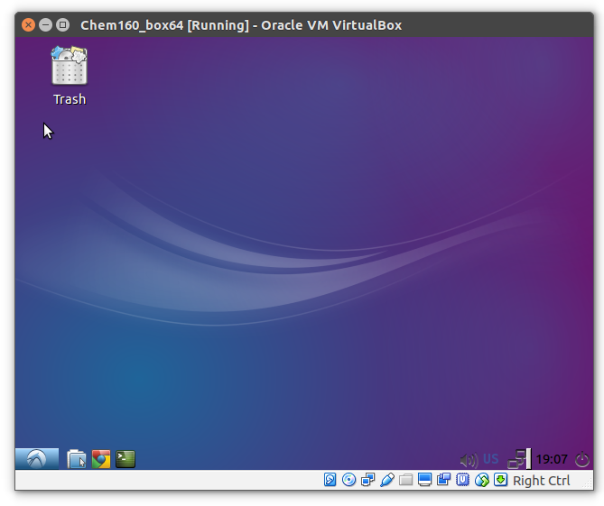
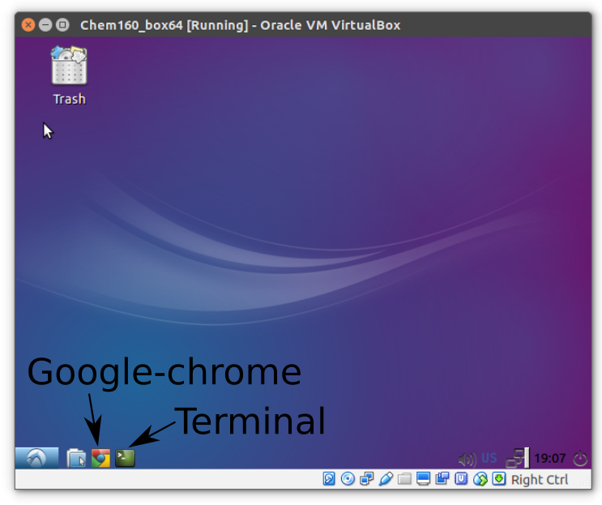
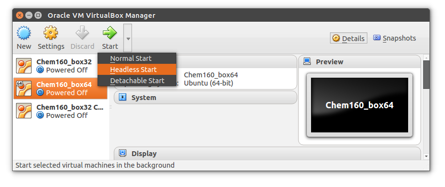
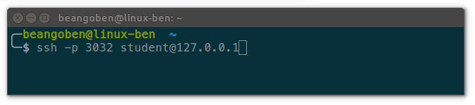
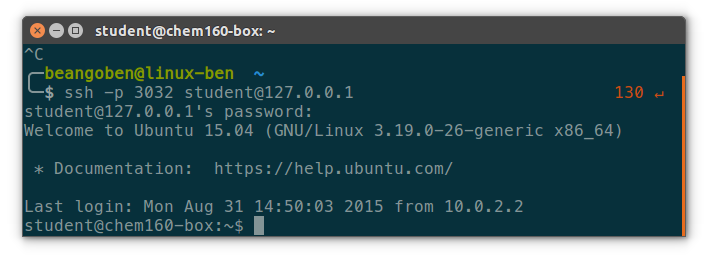
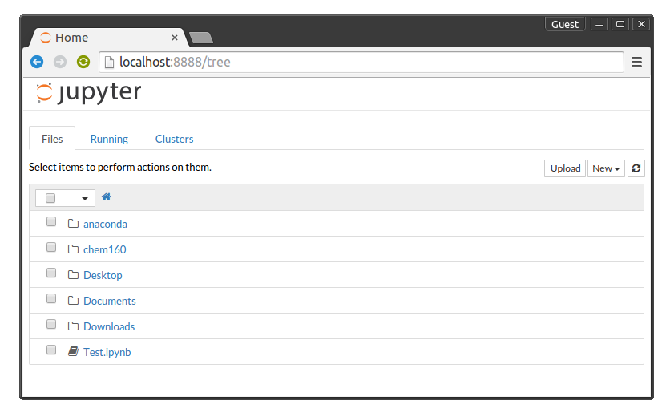

# Welcome to the Chem160 code repository

*   Overview
*   Requirements
*   Installation guide:
    * Working with the virtual machines
    * Want to run stuff on your computer?
*   Extra info

## Overview

In this course you'll get a sense of how quantum mechanics is used to solved chemistry problems.
One of the ways we will get to understand the quantum world will be via code, we will be coding many of the ideas in the course and creating simulations that solve quantum phenomena.
We will primarily use Ipython notebooks, a great tool for sharing code, running calculations and

For the first part of the course we will use common scientific python libraries that are included in any anaconda instalation.

Later we will use specialized modules and software that is normally used in a professional setting. Since there is a wide variety of computer enviroments, we have a created virtualboxes which contain all the software required for the course.

## Requirements

* Internet Browser, **Google Chrome** highly recommended.
* [Python **2.7.x**](https://www.python.org/downloads/)
* A terminal (MacOSX and Linux have native *good* terminals, for Windows [cmder](http://cmder.net/) is recommended)
* [VirtualBox **5.X**](https://www.virtualbox.org/wiki/Downloads) with the Extension pack.
* [Ipython notebook](http://ipython.org/notebook.html) > **3.x** , we will use **4.x** also known as [Jupyter](https://jupyter.org)
* Modules: **[scipy](http://www.scipy.org/), [numpy](http://www.numpy.org/), [matplotlib](http://matplotlib.org/).**
* Chemistry modules: **[rdkit](http://www.rdkit.org/), [openbabel](http://openbabel.org/), [imolecule](http://patrick-fuller.com/imolecule/), [PyQuante](http://pyquante.sourceforge.net/).**

## Installation guide
Installing all the required software can be hard if you have never compiled code, hence we will rely on the virtual machines for any code related activities.

If **you are interested in setting up software for your computer we can help**, <font color="red">but only during the first two weeks. </font> After that support will be dedicated only to VirtualBox problems.

Just to note: In a Linux based computer it is relatively easy to install all the course software. On MacOsX it is a bit more difficult. And on Windows, it's a pain.

## Working with the virtual machines:
### **1** Install VirtualBox version 5.x
(click me)
[](https://www.virtualbox.org/)

#### Don't forget the VirtualBox Extensions Pack (it's on the same page)

### **2**  Copy your virtual drive




### **3**  Starting ipython notebook within your vbox
It should look like the following image:

From here do:
* Open a terminal by clicking on the icon.
* Type the command **ipython notebook** and press enter, the ipython notebook should be running.
* Open google-chrome.
* Type **localhost:8888** in the address bar.
* You should see something like the following screen:

Here you can navigate the files on the computer, you will be using the chem160 folder as a home base for all code (problem sets, demos, extra stuff).
You can enter a folder by clicking on it.

* Navigate to **chem160/extras/TestInstallation.ipynb**
* Run the code! This will test if you have all the required modules for the course.
* You can update this code repository by running "**update-course**", so any time you need to download the latest problem sets, execute away!

### **4** Headless Virtualbox (optional but **recommended**)
If you feel your virtual machine is a bit slow, it is possible to run the virtual machine in *headless* mode, with no graphics. Sort of like a calculation server.

You will run the code on the virtualbox...but all graphics rendering will happen on your computer inside of a web browser.

#### 4.1 : Bootup your virtual machine in headless mode


#### 4.2 : Open a terminal and connect via ssh



You can explore this windowless computer via ssh in a terminal window, using the following command:

```bash
ssh -p 3032 student@127.0.0.1
```

If all was succesful you will see a message like this:

Now you have total control over the virtual machine...from there you can start an ipython server by typing

```bash
ipython-server
```
#### 4.3 : Open a google-chrome into localhost:8888


** Voila!** Jupyter is alive! (remotely)




#### Extras: Copying files, updating the course
You can update the course material via:
```bash
update-course
```
or copy a file or folder from Directory1 on the virtual box to directory2 on your machine
```bash
scp -r -p 3032 student@127.0.0.1:Directory1 Directory2
```
For example to copy your problem set # 1 to your current directory would be:

```bash
scp -r -p 3032 student@127.0.0.1:~/chem160/problem_sets/1_Intro_Ipython .
```
or reverse!, to copy a file on your computer to the virtual box:
```bash
scp -r -p 3032 file student@127.0.0.1:~/
```
** ssh config file (Linux and MacOSX)**
If you hate having to type *-p 3032 student@127.0.0.1* everytime you can edit your ssh config file to make the command way shorter:
```bash
ssh chem160-box64
```
by inserting the following code into **!/.ssh/config**:

```bash
Host chem160-box64
    User student
    Hostname 127.0.0.1
    Port 3032
```

## Want to run stuff on your computer?
Again! Only recommend if you like to suffer or would like to learn how to compile code / setup enviroments. Most of the work can be done via the Anaconda scientific python distribution.

[](http://continuum.io/downloads#all)

But installing properly openbabel and rdkit can be a bit more complicated, especially if you are on Windows (openbabel is compiled for 32 bit only).

The overall steps are:

* Download and install Anaconda (easy)
* Update all packages via the termianl command **"conda update --all"**
* Probably install **"conda install anaconda-client"**
* Install also: **"conda install ipython notebook ipywidgets"**
* Install via [conda bisntar](https://binstar.org/) **rdkit, openbabel and imolecule**. If you are in luck somebody already installed them...if not..you will have to download and compile code.
* Compile and Install Pyquante, it is recommend to follow the instructions [here](http://aalopes.com/blog/?p=36).

## Extra info
